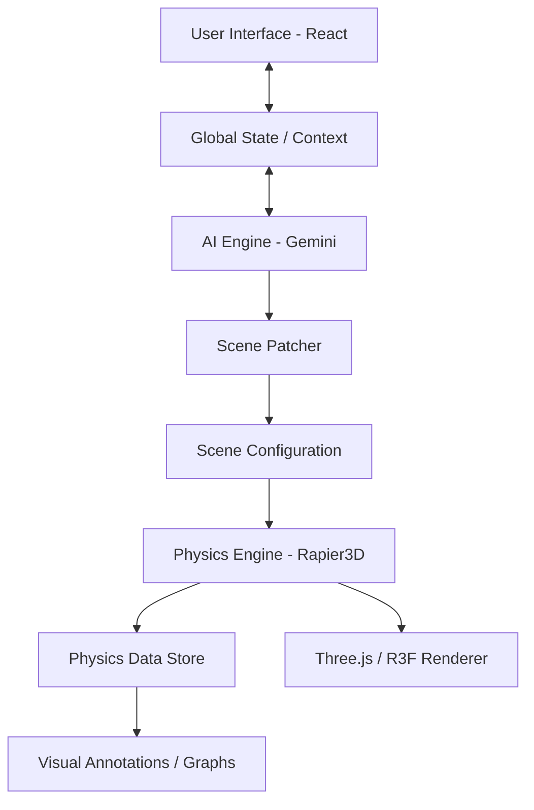

# System Architecture - PhysicsVisualizer

This document outlines the technical architecture and data flow of the PhysicsVisualizer platform.

## 1. High-Level Overview

PhysicsVisualizer is designed as a decoupled, layered system where the UI, Physics, and AI components communicate through well-defined interfaces.

---

## 2. Layered Architecture

### 2.1 Frontend Layer (UI & Rendering)
- **Framework**: React 19 with Vite.
- **3D Rendering**: `@react-three/fiber` (R3F) provides a declarative bridge to Three.js.
- **Component Library**: Custom-built workbench components using modular CSS.
- **Visual Annotations**: A specialized layer that renders vectors and labels. It bypasses standard React state for high-frequency updates by reading directly from the `PhysicsDataStore`.

### 2.2 Core Physics Layer
The physics system is hybrid, combining a general-purpose engine with specialized solvers.
- **Primary Engine**: **Rapier3D** (WASM) handles rigid body dynamics, collisions, and standard joints.
- **Gravitational Solver**: A custom N-body implementation for high-precision orbital mechanics.
- **Fluid Dynamics**: A custom solver for buoyancy and drag forces, integrated into the Rapier simulation loop.
- **Physics Data Store**: A high-performance, non-reactive store that holds the latest positions, velocities, and energies of all objects, accessible by the UI at 60fps.

### 2.3 AI Intelligence Layer
- **LLM**: Google Gemini 2.5 Flash.
- **Scene Patcher**: Translates natural language intent into JSON Patch operations (RFC 6902). This allows the AI to modify specific properties of the scene (e.g., "make the ball red") without re-sending the entire scene state.
- **Tool Registry**: A system that allows the AI to execute sandboxed JavaScript.
    - **JavaScript Executor**: Runs code to generate complex mathematical shapes or perform batch calculations.
    - **Function Calling**: Maps AI requests to internal system functions.

---

## 3. Data Flow

### 3.1 Scene Modification Flow
1. **Input**: User types "Add a heavy cube at the center" in the ChatView.
2. **Processing**: Gemini AI processes the request and identifies the need for a scene change.
3. **Patching**: The AI generates a patch (e.g., `{ op: 'add', path: '/objects/-', value: { type: 'Box', mass: 100, ... } }`).
4. **Validation**: The `ScenePatcher` validates the patch against physics constraints.
5. **Sync**: The global scene state is updated, triggering the Physics Engine to instantiate a new RigidBody.

### 3.2 Simulation Loop
1. **Step**: The Physics Engine steps the simulation (typically 60 times per second).
2. **Update**: Rigid body transforms are updated in the WASM memory.
3. **Capture**: The `PhysicsDataStore` captures the new state (velocity, position).
4. **Render**: 
    - Three.js updates the visual mesh positions.
    - `VisualAnnotationManager` reads from the Store to draw velocity vectors.
    - `ChartView` reads from the Store to plot real-time energy graphs.

---

## 4. Infrastructure & Performance

- **Web Workers**: Physics calculations and heavy AI parsing are offloaded to background threads to prevent UI jank.
- **IndexedDB**: Used for local persistence of user-created scenes and conversation history.
- **Instanced Rendering**: Used for particle systems and large-scale object groups to minimize draw calls.
- **WASM**: Rapier3D runs as a WebAssembly module for near-native performance in the browser.
